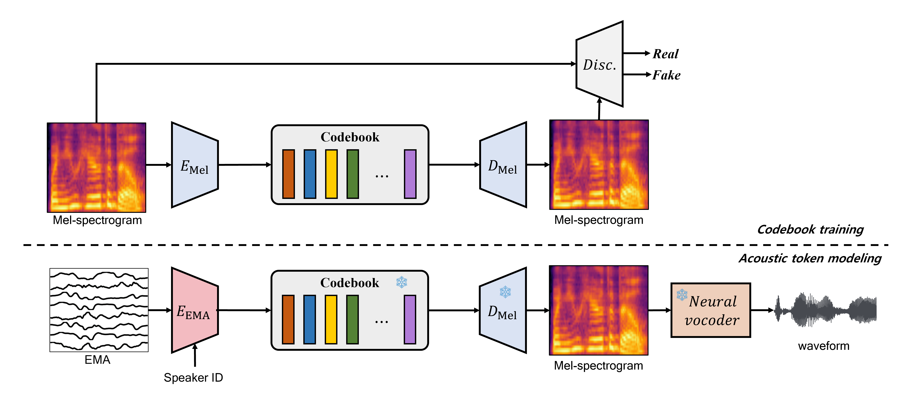

# Bluemarble

### Submitted to ICASSP 2024 (paper number: 7835)

## Abstract

In this paper, we introduce BlueMarble, a neural articulation-to-speech (ATS) system that synthesizes high-quality speech from articulatory recordings. Conventional ATS approaches are only available for high-resource datasets, which require parallel articulatory and speech signal pairs for network training. These approaches often treat acoustic feature estimation as a regression task, which can pose challenges in accurately mapping complex latent features to targets. We address this task by utilizing a finite learned codebook to limit the size of the uncertainty space.  Our model learns a mapping from electromagnetic articulography (EMA) signals to discrete speech tokens from a pretrained encoder-decoder model. Then, a decoder network utilizes the discrete EMA tokens to predict acoustic features, which are fed into a neural vocoder to synthesize speech. Experimental results show that our approach outperforms existing state-of-the-art methods in both qualitative and quantitative assessments. 

<!-- <audio controls><source src='./demo_sample/F01_B02_S60_R02_N.wav'></audio> -->
<table border="1">
	<form action="" id="setRows">
		

			<input type="text" name="rowPerPage" value="10">
		

	</form>
	<thread>
		<tr>
		  	<td style="column-width: 600px; padding-left: 10px; padding-right: 10px"><strong>Reference speech</strong></td>
			<td style="column-width: 600px; padding-left: 10px; padding-right: 10px"><strong>Baseline</strong></td>
			<td style="column-width: 600px; padding-left: 10px; padding-right: 10px"><strong>Bluemarble (Ours)</strong></td>
		</tr>
	</thread>
	<tbody>
		<tr>
		  <td><audio controls><source src='./demo_sample/F01_B02_S60_R02_N_target.wav'></audio></td>
		  <td><audio controls><source src='./demo_sample/F01_B02_S60_R02_N.wav'></audio></td>
		  <td><audio controls><source src='./demo_sample/F01_B02_S60_R02_N_recon.wav'></audio></td>
		</tr>
		<tr>
		  <td><audio controls><source src='./demo_sample/F01_B04_S54_R01_N_target.wav'></audio></td>
		  <td><audio controls><source src='./demo_sample/F01_B04_S54_R01_N.wav'></audio></td>
		  <td><audio controls><source src='./demo_sample/F01_B04_S54_R01_N_recon.wav'></audio></td>
		</tr>
		<tr>
		  <td><audio controls><source src='./demo_sample/F01_B05_S22_R01_F_target.wav'></audio></td>
		  <td><audio controls><source src='./demo_sample/F01_B05_S22_R01_F.wav'></audio></td>
		  <td><audio controls><source src='./demo_sample/F01_B05_S22_R01_F_recon.wav'></audio></td>
		</tr>
		<tr>
		  <td><audio controls><source src='./demo_sample/F01_B05_S29_R02_N_target.wav'></audio></td>
		  <td><audio controls><source src='./demo_sample/F01_B05_S29_R02_N.wav'></audio></td>
		  <td><audio controls><source src='./demo_sample/F01_B05_S29_R02_N_recon.wav'></audio></td>
		</tr>
		<tr>
		  <td><audio controls><source src='./demo_sample/F01_B05_S54_R01_N_target.wav'></audio></td>
		  <td><audio controls><source src='./demo_sample/F01_B05_S54_R01_N.wav'></audio></td>
		  <td><audio controls><source src='./demo_sample/F01_B05_S54_R01_N_recon.wav'></audio></td>
		</tr>
		<tr>
		  <td><audio controls><source src='./demo_sample/F01_B06_S34_R01_N_target.wav'></audio></td>
		  <td><audio controls><source src='./demo_sample/F01_B06_S34_R01_N.wav'></audio></td>
		  <td><audio controls><source src='./demo_sample/F01_B06_S34_R01_N_recon.wav'></audio></td>
		</tr>
		<tr>
		  <td><audio controls><source src='./demo_sample/F02_B02_S13_R02_N_target.wav'></audio></td>
		  <td><audio controls><source src='./demo_sample/F02_B02_S13_R02_N.wav'></audio></td>
		  <td><audio controls><source src='./demo_sample/F02_B02_S13_R02_N_recon.wav'></audio></td>
		</tr>
		<tr>
		  <td><audio controls><source src='./demo_sample/F02_B02_S24_R01_F_target.wav'></audio></td>
		  <td><audio controls><source src='./demo_sample/F02_B02_S24_R01_F.wav'></audio></td>
		  <td><audio controls><source src='./demo_sample/F02_B02_S24_R01_F_recon.wav'></audio></td>
		</tr>
		<tr>
		  <td><audio controls><source src='./demo_sample/F02_B04_S48_R01_N_target.wav'></audio></td>
		  <td><audio controls><source src='./demo_sample/F02_B04_S48_R01_N.wav'></audio></td>
		  <td><audio controls><source src='./demo_sample/F02_B04_S48_R01_N_recon.wav'></audio></td>
		</tr>
		<tr>
		  <td><audio controls><source src='./demo_sample/F02_B05_S49_R01_N_target.wav'></audio></td>
		  <td><audio controls><source src='./demo_sample/F02_B05_S49_R01_N.wav'></audio></td>
		  <td><audio controls><source src='./demo_sample/F02_B05_S49_R01_N_recon.wav'></audio></td>
		</tr>
		<tr>
		  <td><audio controls><source src='./demo_sample/F02_B06_S17_R01_F_target.wav'></audio></td>
		  <td><audio controls><source src='./demo_sample/F02_B06_S17_R01_F.wav'></audio></td>
		  <td><audio controls><source src='./demo_sample/F02_B06_S17_R01_F_recon.wav'></audio></td>
		</tr>
		<tr>
		  <td><audio controls><source src='./demo_sample/F02_B06_S26_R01_F_target.wav'></audio></td>
		  <td><audio controls><source src='./demo_sample/F02_B06_S26_R01_F.wav'></audio></td>
		  <td><audio controls><source src='./demo_sample/F02_B06_S26_R01_F_recon.wav'></audio></td>
		</tr>
		<tr>
		  <td><audio controls><source src='./demo_sample/F03_B01_S10_R02_N_target.wav'></audio></td>
		  <td><audio controls><source src='./demo_sample/F03_B01_S10_R02_N.wav'></audio></td>
		  <td><audio controls><source src='./demo_sample/F03_B01_S10_R02_N_recon.wav'></audio></td>
		</tr>
		<tr>
		  <td><audio controls><source src='./demo_sample/F03_B02_S02_R01_N_target.wav'></audio></td>
		  <td><audio controls><source src='./demo_sample/F03_B02_S02_R01_N.wav'></audio></td>
		  <td><audio controls><source src='./demo_sample/F03_B02_S02_R01_N_recon.wav'></audio></td>
		</tr>
		<tr>
		  <td><audio controls><source src='./demo_sample/F03_B02_S35_R01_F_target.wav'></audio></td>
		  <td><audio controls><source src='./demo_sample/F03_B02_S35_R01_F.wav'></audio></td>
		  <td><audio controls><source src='./demo_sample/F03_B02_S35_R01_F_recon.wav'></audio></td>
		</tr>
		<tr>
		  <td><audio controls><source src='./demo_sample/F04_B01_S26_R01_F_target.wav'></audio></td>
		  <td><audio controls><source src='./demo_sample/F04_B01_S26_R01_F.wav'></audio></td>
		  <td><audio controls><source src='./demo_sample/F04_B01_S26_R01_F_recon.wav'></audio></td>
		</tr>
		<tr>
		  <td><audio controls><source src='./demo_sample/F04_B02_S14_R01_F_target.wav'></audio></td>
		  <td><audio controls><source src='./demo_sample/F04_B02_S14_R01_F.wav'></audio></td>
		  <td><audio controls><source src='./demo_sample/F04_B02_S14_R01_F_recon.wav'></audio></td>
		</tr>
		<tr>
		  <td><audio controls><source src='./demo_sample/F04_B05_S12_R01_F_target.wav'></audio></td>
		  <td><audio controls><source src='./demo_sample/F04_B05_S12_R01_F.wav'></audio></td>
		  <td><audio controls><source src='./demo_sample/F04_B05_S12_R01_F_recon.wav'></audio></td>
		</tr>
		<tr>
		  <td><audio controls><source src='./demo_sample/F04_B05_S15_R01_F_target.wav'></audio></td>
		  <td><audio controls><source src='./demo_sample/F04_B05_S15_R01_F.wav'></audio></td>
		  <td><audio controls><source src='./demo_sample/F04_B05_S15_R01_F_recon.wav'></audio></td>
		</tr>
		<tr>
		  <td><audio controls><source src='./demo_sample/F04_B06_S13_R01_N_target.wav'></audio></td>
		  <td><audio controls><source src='./demo_sample/F04_B06_S13_R01_N.wav'></audio></td>
		  <td><audio controls><source src='./demo_sample/F04_B06_S13_R01_N_recon.wav'></audio></td>
		</tr>
		<tr>
		  <td><audio controls><source src='./demo_sample/F04_B07_S60_R01_N_target.wav'></audio></td>
		  <td><audio controls><source src='./demo_sample/F04_B07_S60_R01_N.wav'></audio></td>
		  <td><audio controls><source src='./demo_sample/F04_B07_S60_R01_N_recon.wav'></audio></td>
		</tr>
		<tr>
		  <td><audio controls><source src='./demo_sample/M01_B01_S43_R01_N_target.wav'></audio></td>
		  <td><audio controls><source src='./demo_sample/M01_B01_S43_R01_N.wav'></audio></td>
		  <td><audio controls><source src='./demo_sample/M01_B01_S43_R01_N_recon.wav'></audio></td>
		</tr>
		<tr>
		  <td><audio controls><source src='./demo_sample/M01_B02_S51_R01_F_target.wav'></audio></td>
		  <td><audio controls><source src='./demo_sample/M01_B02_S51_R01_F.wav'></audio></td>
		  <td><audio controls><source src='./demo_sample/M01_B02_S51_R01_F_recon.wav'></audio></td>
		</tr>
		<tr>
		  <td><audio controls><source src='./demo_sample/M01_B05_S08_R01_N_target.wav'></audio></td>
		  <td><audio controls><source src='./demo_sample/M01_B05_S08_R01_N.wav'></audio></td>
		  <td><audio controls><source src='./demo_sample/M01_B05_S08_R01_N_recon.wav'></audio></td>
		</tr>
		<tr>
		  <td><audio controls><source src='./demo_sample/M01_B05_S09_R01_N_target.wav'></audio></td>
		  <td><audio controls><source src='./demo_sample/M01_B05_S09_R01_N.wav'></audio></td>
		  <td><audio controls><source src='./demo_sample/M01_B05_S09_R01_N_recon.wav'></audio></td>
		</tr>
		<tr>
		  <td><audio controls><source src='./demo_sample/M02_B01_S44_R02_N_target.wav'></audio></td>
		  <td><audio controls><source src='./demo_sample/M02_B01_S44_R02_N.wav'></audio></td>
		  <td><audio controls><source src='./demo_sample/M02_B01_S44_R02_N_recon.wav'></audio></td>
		</tr>
		<tr>
		  <td><audio controls><source src='./demo_sample/M02_B01_S51_R01_N_target.wav'></audio></td>
		  <td><audio controls><source src='./demo_sample/M02_B01_S51_R01_N.wav'></audio></td>
		  <td><audio controls><source src='./demo_sample/M02_B01_S51_R01_N_recon.wav'></audio></td>
		</tr>
		<tr>
		  <td><audio controls><source src='./demo_sample/M02_B01_S52_R02_N_target.wav'></audio></td>
		  <td><audio controls><source src='./demo_sample/M02_B01_S52_R02_N.wav'></audio></td>
		  <td><audio controls><source src='./demo_sample/M02_B01_S52_R02_N_recon.wav'></audio></td>
		</tr>
		<tr>
		  <td><audio controls><source src='./demo_sample/M02_B02_S51_R02_N_target.wav'></audio></td>
		  <td><audio controls><source src='./demo_sample/M02_B02_S51_R02_N.wav'></audio></td>
		  <td><audio controls><source src='./demo_sample/M02_B02_S51_R02_N_recon.wav'></audio></td>
		</tr>
		<tr>
		  <td><audio controls><source src='./demo_sample/M02_B05_S02_R01_N_target.wav'></audio></td>
		  <td><audio controls><source src='./demo_sample/M02_B05_S02_R01_N.wav'></audio></td>
		  <td><audio controls><source src='./demo_sample/M02_B05_S02_R01_N_recon.wav'></audio></td>
		</tr>
		<tr>
		  <td><audio controls><source src='./demo_sample/M02_B05_S37_R01_N_target.wav'></audio></td>
		  <td><audio controls><source src='./demo_sample/M02_B05_S37_R01_N.wav'></audio></td>
		  <td><audio controls><source src='./demo_sample/M02_B05_S37_R01_N_recon.wav'></audio></td>
		</tr>
		<tr>
		  <td><audio controls><source src='./demo_sample/M03_B01_S16_R02_N_target.wav'></audio></td>
		  <td><audio controls><source src='./demo_sample/M03_B01_S16_R02_N.wav'></audio></td>
		  <td><audio controls><source src='./demo_sample/M03_B01_S16_R02_N_recon.wav'></audio></td>
		</tr>
		<tr>
		  <td><audio controls><source src='./demo_sample/M03_B03_S24_R01_F_target.wav'></audio></td>
		  <td><audio controls><source src='./demo_sample/M03_B03_S24_R01_F.wav'></audio></td>
		  <td><audio controls><source src='./demo_sample/M03_B03_S24_R01_F_recon.wav'></audio></td>
		</tr>
		<tr>
		  <td><audio controls><source src='./demo_sample/M03_B03_S38_R01_N_target.wav'></audio></td>
		  <td><audio controls><source src='./demo_sample/M03_B03_S38_R01_N.wav'></audio></td>
		  <td><audio controls><source src='./demo_sample/M03_B03_S38_R01_N_recon.wav'></audio></td>
		</tr>
		<tr>
		  <td><audio controls><source src='./demo_sample/M03_B04_S57_R01_N_target.wav'></audio></td>
		  <td><audio controls><source src='./demo_sample/M03_B04_S57_R01_N.wav'></audio></td>
		  <td><audio controls><source src='./demo_sample/M03_B04_S57_R01_N_recon.wav'></audio></td>
		</tr>
		<tr>
		  <td><audio controls><source src='./demo_sample/M04_B01_S53_R01_N_target.wav'></audio></td>
		  <td><audio controls><source src='./demo_sample/M04_B01_S53_R01_N.wav'></audio></td>
		  <td><audio controls><source src='./demo_sample/M04_B01_S53_R01_N_recon.wav'></audio></td>
		</tr>
		<tr>
		  <td><audio controls><source src='./demo_sample/M04_B05_S06_R01_N_target.wav'></audio></td>
		  <td><audio controls><source src='./demo_sample/M04_B05_S06_R01_N.wav'></audio></td>
		  <td><audio controls><source src='./demo_sample/M04_B05_S06_R01_N_recon.wav'></audio></td>
		</tr>
		<tr>
		  <td><audio controls><source src='./demo_sample/M04_B05_S39_R01_N_target.wav'></audio></td>
		  <td><audio controls><source src='./demo_sample/M04_B05_S39_R01_N.wav'></audio></td>
		  <td><audio controls><source src='./demo_sample/M04_B05_S39_R01_N_recon.wav'></audio></td>
		</tr>
	</tbody>
</table>

